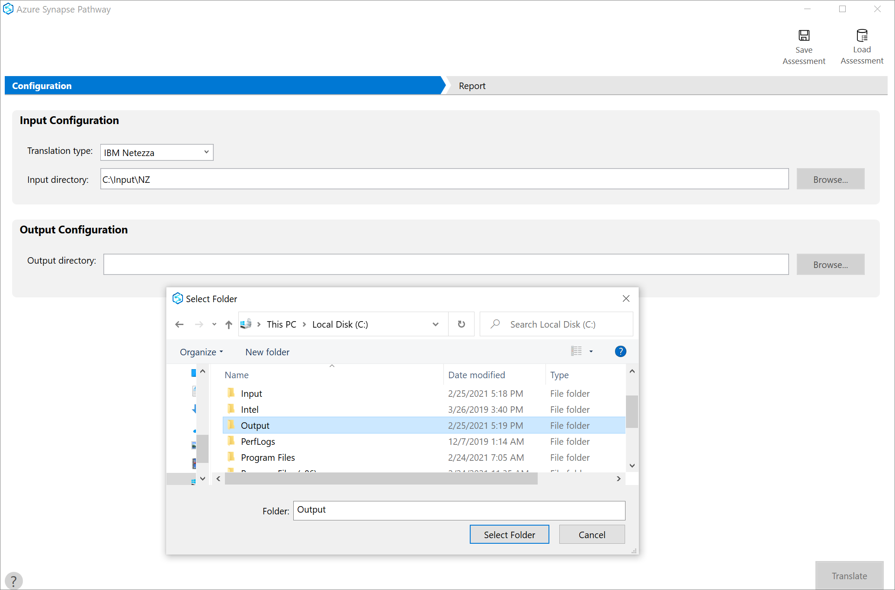

<!--
Remove all the comments in this template before you sign-off or merge to the 
main branch.
-->

<!--
This template provides the basic structure of a tutorial article.
See the [tutorial guidance](contribute-how-to-mvc-tutorial.md) in the contributor guide.

To provide feedback on this template contact 
[the templates workgroup](mailto:templateswg@microsoft.com).
-->

<!-- 1. H1 
Required. Start with "Tutorial: ". Make the first word following "Tutorial: " a 
verb.
-->

# Tutorial to perform your first code translation with Azure Synapse Translate 

<!-- 2. Introductory paragraph 
Required. Lead with a light intro that describes, in customer-friendly language, 
what the customer will learn, or do, or accomplish. Answer the fundamental “why 
would I want to do this?” question. Keep it short.
-->

Azure Synapse Pathway v1.0 introduces support for translating Schemas, Tables, Views, Functions etc. from **Netezza**, **Teradata**, **Snowflake**, **Microsoft SQL Server** into T-SQL complaint code that automates migration to Azure Synapse Analytics.
 
For more information, see the blog post [Use Azure Synapse Pathway to migrate your on-premise and cloud data warehouse to Azure Synapse Analytics](https://techcommunity.microsoft.com/t5/azure-synapse-analytics/bg-p/AzureSynapseAnalyticsBlog)

<!-- 3. Tutorial outline 
Required. Use the format provided in the list below.
-->

In this tutorial, you learn how to:

> [!div class="checklist"]
> * Run your first translation of the SQL scripts in your existing data warheouse to T-SQL scripts for Azure Synpase SQL 
> * Choose from one of the available sources
> * View the error and warnings about the objects that didn't get translated

<!-- 4. Prerequisites 
Required. First prerequisite is a link to a free trial account if one exists. If there 
are no prerequisites, state that no prerequisites are needed for this tutorial.
-->

## Prerequisites

This tutorial assumes you have already installed the Azure Synapse Translate MSI. If you need an introduction, see [Perform a Data warehouse code translation with Azure Synapse Translate](http://www.asp.net/mvc/overview/getting-started/introduction/getting-started).

## Run the translation
<!-- Introduction paragraph -->

1. Launch the Azure Synapse Translate MSI. Follow steps as listed here to make sure you have the latest version the Azure Synapse Translate installer.

1. Select from one of the available sources, the ones that will be added soon are grayed out.
1. In the Input directory folder, click on browse and point the tool to the folder location of the **DDL** and **DML** scripts that need to be translated..
1. When translating the Netezza code to Azure Synapse Analytics, choose IBM Netezza in the Translation Type drop down

  

6. To select the output directory, click on browse to specify the location where the output will be generated.
 

1. If you enable the single file output,
1. Click on translate to start the translation
> [!NOTE]
In this version of Azure Synapse Translate, you cannot specify the individual files and folder but rather one location where all the scripts are stored. If there are multiple folders, then you can run multiple translations to migrate the code.

## View Results
1. The duration of the assessment depends on the number of databases added and the schema size of each database. Results are displayed for each database as soon as they're available.
 

1. When you click on view results, it will take you to the output directory specified in the previous step and you will see the translated script file.  
1. There will be a results file uploaded in the same output directory which will have a list of errors and warnings.

## Next steps

[Learn how to save and load the assessment](contribute-how-to-mvc-tutorial.md)

<!--
Remove all the comments in this template before you sign-off or merge to the 
main branch.
-->